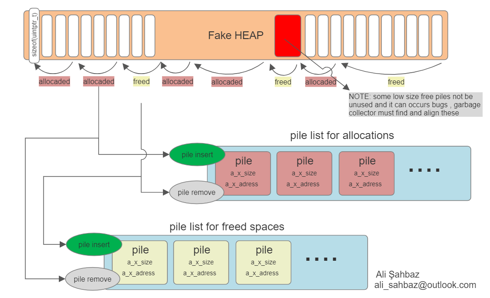
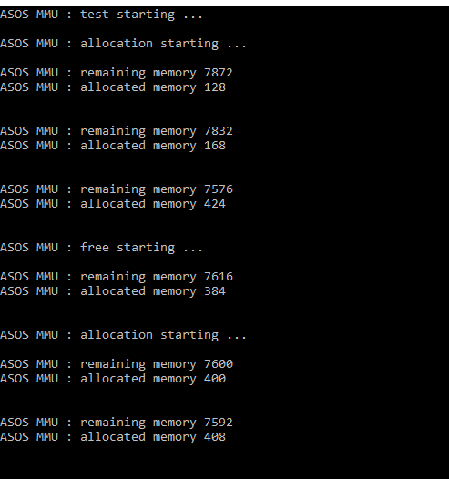

# asos_mmu

The Memory Management Unit (MMU) is a hardware component found in modern computer systems and other data processing devices. Its primary function is to handle the memory management tasks of the system, particularly in systems with virtual memory.

In computer systems, the memory is divided into two main types: physical memory (RAM) and logical or virtual memory. The physical memory is the actual RAM installed in the computer, while the virtual memory is an abstraction that allows the system to use a combination of RAM and secondary storage devices (such as the hard disk) to extend the effective memory space.

The MMU acts as an intermediary between the central processing unit (CPU) and the memory, translating virtual memory addresses into physical memory addresses. When a program accesses data or instructions, it uses virtual memory addresses, which are translated by the MMU into corresponding physical memory addresses to retrieve the data from the RAM. This translation process allows the system to utilize virtual memory efficiently and manage memory resources effectively.

The MMU also helps in memory protection and memory sharing between different processes. It sets up memory access permissions to prevent unauthorized access to certain memory regions and ensures that processes do not interfere with each other's memory space, providing isolation and security to the system.

In summary, the Memory Management Unit plays a crucial role in managing memory resources, providing virtual memory support, and ensuring efficient and secure memory access in modern computer systems and data processing devices.

--------------------------------------------------------------------------------------------------------------------------------------------------------------------
# WHY are we cheating the HEAP field?

Main reason : there is no garbage collector in Embedded Projects, at least for now :)

malloc is considered dangerous for embedded projects due to the following reasons:

Memory Fragmentation: In embedded systems with limited memory, dynamic memory allocation using malloc can lead to memory fragmentation. Over time, small unused gaps may form between allocated memory blocks, reducing memory efficiency and potentially leading to memory exhaustion.

Unpredictable Execution Time: Memory allocation with malloc can take an unpredictable amount of time, especially in scenarios with memory fragmentation. In real-time embedded systems, where precise timing is crucial, unpredictable execution times can cause performance issues and impact system responsiveness.

Memory Leaks: If memory allocated by malloc is not properly deallocated using free, memory leaks can occur. Memory leaks gradually consume available memory, leading to potential system crashes or undefined behavior.

Lack of Memory Safety: malloc does not perform bounds checking, leaving the possibility of buffer overflows or other memory-related errors. In embedded systems, where memory protection is essential, using malloc requires additional checks to prevent security vulnerabilities and system instability.

Limited Error Handling: malloc may return a NULL pointer if it fails to allocate memory, indicating a memory shortage. In resource-constrained embedded systems, ignoring NULL pointer returns can lead to unpredictable behavior and crashes.

Non-Deterministic Behavior: Embedded systems often require deterministic behavior, especially in real-time applications. However, dynamic memory allocation with malloc introduces non-determinism due to variable memory allocation times and potential fragmentation.

To mitigate these risks, embedded developers often prefer static memory allocation or use custom memory management techniques like fixed-size memory pools or stack-based memory management. These approaches help ensure predictable behavior and efficient memory usage in embedded projects.

--------------------------------------------------------------------------------------------------------------------------------------------------------------------

# Conceptual Design

So what did I do ->

In summary : Data section would be deceived.

 
'asos_mmu' Data section management algorithm.

RUN EXE:

--------------------------------------------------------------------------------------------------------------------------------------------------------------------

# Requirements
------
' OOP C ' 
Visual Studio 2022 for test. 
it can be use in every Hardware/PC/Framework.
You can use this library for your Embedded Projects.
 
# Contact
------
Created By Ali Sahbaz 
-> ali_sahbaz@outlook.com 
-> [MY LINKEDIN ACCOUNT](https://www.linkedin.com/in/ali-%C5%9Fahbaz-6588a8115/)
